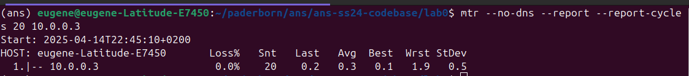
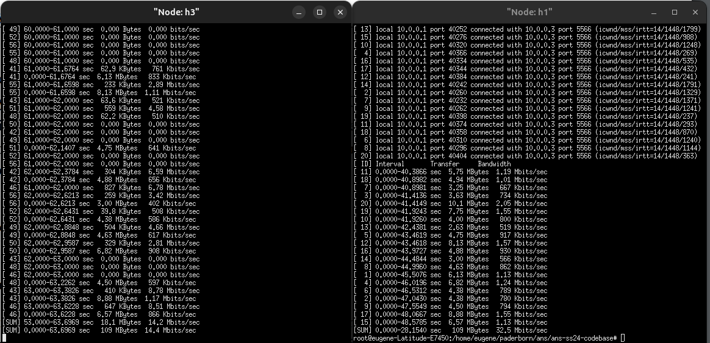

# Warmm up Exercise

## Analyzing h1 and h3

Run iperf h1 - h3 tcp for 20 seconds and analyzing the latency

```sh
iperf -c 10.0.0.3 -p 5566 -t 20 -P 20
```
We have th following results


The throughput using Iperf `-P` option


The average throughput  h1 = 32.5/20 = `1.67 Mb/s`
The average throughput  h3 = 14.4/20 = `0.7 Mb/s`

